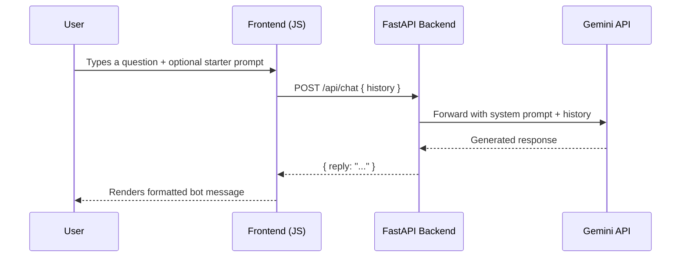

<p align="center">
  
  
  
</p>

# ✨ Nova — AI Tutor

Nova is an intelligent, conversational AI tutor powered by Google's Gemini API. It provides clear explanations, real-world analogies, and interactive learning across core CS subjects — all through a sleek, space-themed chat interface.

---

## 🎯 Features

### Core
- **AI-Powered Chat** — Conversational tutoring powered by Gemini 3.1 Flash Lite
- **Topic-Aware Context** — Select a subject (Python, SQL, ML, DSA, Maths) and all responses are tailored to that context
- **Conversation History** — Full multi-turn chat with memory, so Nova remembers what you discussed

### Smart Prompts
- **Quick Starter Buttons** — One-click prompt modifiers:
  - 🧒 *Explain like I'm 12* — Simplify any concept
  - 🔗 *Give me an analogy* — Get a real-world comparison
  - 📝 *Quiz me on this* — Test your understanding
  - 🧭 *What should I learn next?* — Get a learning path
  - 🆘 *I'm confused, help!* — Break it down step by step
- **Composable Prompts** — Starter buttons **prepend** to your input, so you can combine them with your own question (e.g., `Explain like I'm 12: What is recursion?`)
- **Toggle Behavior** — Click a starter to activate, click again to deactivate. Active state is visually highlighted.

### Design
- **Dark Space Theme** — Deep black background with cyan accent glow
- **Glassmorphism Bubbles** — Frosted glass chat bubbles with subtle inner glow
- **Animated Typing Indicator** — Pulsing dots while Nova is thinking
- **Shimmer Logo** — Gradient text animation on the Nova wordmark
- **Responsive Layout** — Works on desktop and mobile

---

## 🏗️ Architecture

```
nova/
├── backend/
│   ├── app.py              # FastAPI server + Gemini API integration
│   ├── requirements.txt    # Python dependencies
│   └── .env                # API key configuration (git-ignored)
├── frontend/
│   ├── index.html          # Main HTML structure
│   ├── style.css           # Full design system (dark theme, animations)
│   └── script.js           # Chat logic, message rendering, quick starters
└── README.md
```

### How It Works



---

## 🚀 Getting Started

### Prerequisites

- **Python 3.9+**
- A **Google Gemini API Key** — [Get one here](https://aistudio.google.com/app/apikey)

### 1. Clone the Repository

```bash
git clone https://github.com/your-username/nova.git
cd nova
```

### 2. Set Up the Backend

```bash
cd backend

# Create a virtual environment
python -m venv .venv

# Activate it
# Windows:
.venv\Scripts\activate
# macOS/Linux:
source .venv/bin/activate

# Install dependencies
pip install -r requirements.txt
```

### 3. Configure the API Key

Create a `.env` file inside the `backend/` directory:

```env
GEMINI_API_KEY="your_gemini_api_key_here"
```

> ⚠️ **Never commit your `.env` file.** Add it to `.gitignore`.

### 4. Run the Server

```bash
cd backend
python app.py
```

The app will start at **http://127.0.0.1:8000**. Open it in your browser — no separate frontend server needed.

---

## 📡 API Reference

### `POST /api/chat`

Send a chat message with full conversation history.

**Request Body:**

```json
{
  "history": [
    {
      "role": "user",
      "parts": [{ "text": "What is a binary tree?" }]
    }
  ]
}
```

**Response:**

```json
{
  "reply": "A binary tree is a data structure where each node has at most two children..."
}
```

**Error Response:**

```json
{
  "detail": "Gemini API Key is not configured."
}
```

| Status | Meaning |
|--------|---------|
| `200`  | Successful response with `reply` |
| `500`  | API key missing or Gemini API error |

---

## 🧠 System Prompt

Nova's personality is defined by a carefully tuned system prompt:

> *"You are Nova, a sharp and friendly AI tutor. Be encouraging, patient, and never condescending. Use simple language first, then build complexity. Always use short analogies or real-world examples. End every response with a tip, a follow-up question, or encouragement to go deeper. If a student seems stuck, break it into smaller steps. Keep responses concise (3–6 sentences) unless detailed explanation is genuinely needed."*

---

## 🎨 Design System

| Token | Value | Usage |
|-------|-------|-------|
| `--bg-color` | `#07090F` | Page background |
| `--accent-cyan` | `#00D4FF` | Primary accent, glows, active states |
| `--bot-bubble-bg` | `rgba(20, 25, 40, 0.6)` | Bot message background |
| `--user-bubble-bg` | `#1A1D27` | User message background |
| `--font-heading` | `Syne` | Logo and headings |
| `--font-body` | `DM Sans` | All body text |

---

## 📦 Dependencies

| Package | Purpose |
|---------|---------|
| `fastapi` | Web framework for the API server |
| `uvicorn` | ASGI server to run FastAPI |
| `httpx` | Async HTTP client for Gemini API calls |
| `python-dotenv` | Load `.env` file for API key management |

---

## 🛣️ Roadmap

- [ ] Markdown rendering with syntax highlighting (Prism.js)
- [ ] Export chat as PDF
- [ ] Voice input support
- [ ] Multiple chat sessions / history persistence
- [ ] User authentication
- [ ] Deployment to Google Cloud Run

---

## 📄 License

This project is for educational purposes. Built with ❤️ for students everywhere.
